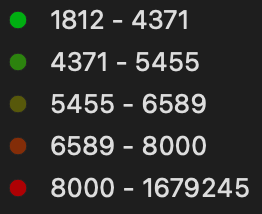

# Property Values in Milan, Italy

## Description

The **Property Values in Milan, Italy** project aims to explore and visualize the impact of Milan's canals on local property prices. This study focuses on the correlation between proximity to these waterways and the price of real estate, measured in euros per square meter (€ / m^2).

### Visuals

Below are the key visuals used in this project:

#### Map Legend

This legend helps in understanding the symbols and color codes used in the map of Milan.
The values are price in euros per square meter (€ / m^2).

#### Screenshot of the Map

This map screenshot provides a snapshot of the current property values around Milan’s canals.

## How to Use

To navigate the interactive maps and view detailed analyses, follow these steps:
1. Open the map file from the repository.
2. Zoom in to focus on areas of interest around the canals.
3. Refer to the map legend to decode symbols and colors indicating property values.
